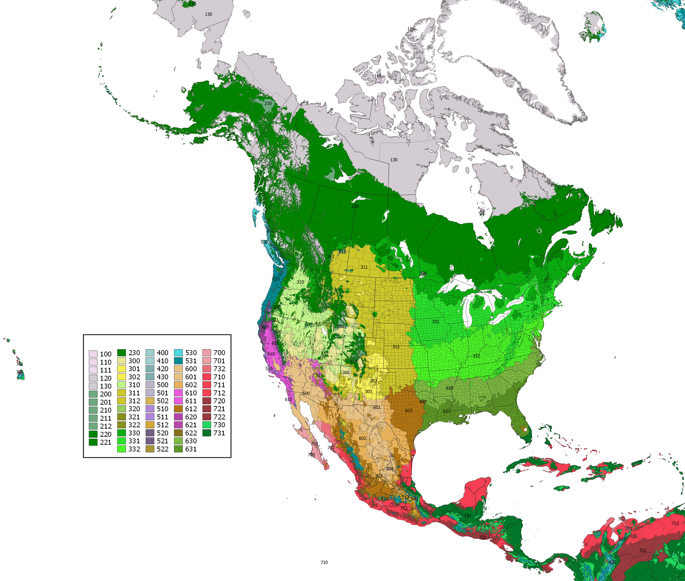

<html><head><style>li {list-style-type: none;}</style></head></html>
```{r setup, include=FALSE}
knitr::opts_chunk$set(echo = TRUE)
```

###Alternative General Climate Map Legend

The pAET threshold for cold winter climates was reduced to 50 mm to accommodate the steppe vegetation in the high plains of North America, below the 75 mm threshold. Below 50 mm, the vegetation has more shrubs. The deficit threshold was increased to 300 mm because tropical forests maintain evergreen status well past the 150 mm threshold. The vegetation becomes more seasonal (deciduous, semi-deciduous, or semi-evergreen) when deficits are above 300 mm or when the P/PET ratio falls below 1, which means that soil is unable to store enough moisture even for deep rooted species.

* 1a. Tc ≥ 0°C and Tclx ≥ -15°C
    * 2a. Tg ≥ 18°C
        * 3a. Tc ≥ 15°C and Tclx ≥ 0°C  ... **Tropical**
            * Annual P/PET ratio ≥ 1 and total monthly deficit < 300 mm
                * Tg ≥ 24  ...   **731 Hot Tropical Isopluvial Humid -- Tropical Lowland Moist Forest**
                * Tg < 24  ...   **730 Warm Tropical Isopluvial Humid -- Tropical Premontane Moist Forest**
            * Annual P/PET ratio < 1 or total monthly deficit ≥ 300 mm
                * Annual P/PET ratio ≥ 0.5 or total monthly surplus ≥ 25 mm
                    * Annual P/PET ratio ≥ 1 ...   **720-722 Tropical Pluviothermic Humid -- Tropical Seasonal/Monsoon Forest**
                    * Annual P/PET ratio < 1 ...   **710-712 Tropical Pluviothermic Subhumid -- Tropical Dry Forest/Savanna**
                * Annual P/PET ratio < 0.5 and total monthly surplus < 25 mm
                    * peak AET ≥ 75 mm ...   **702 Tropical Pluvioxeric -- Tropical Thornscrub**
                    * peak AET < 75 mm ...   **700-701 Tropical Isoxeric -- Tropical Desert**
        * 3b. Tc < 15°C or Tclx < 0°C ... **Subtropical**
            * Annual P/PET ratio ≥ 1 and total monthly deficit < 300 mm
                * Tc ≥ 5° C and Tclx ≥ -10°C  ...   **631 Eu-Subtropical Isopluvial Humid -- Subtropical Evergreen Forest**
                * Tc < 5° C or Tclx < -10°C  ...   **630 Cryo-subtropical Isopluvial Humid -- Subtropical Mixed Evergreen Forest**
            * Annual P/PET ratio < 1 or total monthly deficit ≥ 300 mm
                * Annual P/PET ratio ≥ 0.5 or total monthly surplus ≥ 25 mm
                    * Peak AET ≥ 75 mm.
                        * Annual P/PET ratio ≥ 1 ...   **622 Subtropical Pluviothermic Humid -- Subtropical Woodland/Savanna**
                        * Annual P/PET ratio < 1 ...   **612 Subtropical Pluviothermic Subhumid -- Subtropical Grassland/Prairie**
                    * Peak AET < 75 mm.
                        * Annual P/PET ratio ≥ 1 ...   **620-621 Subtropical Xerothermic Humid -- Subtropical Sclerophyllous Forest**
                        * Annual P/PET ratio < 1 ...   **610-611 Subtropical Xerothermic Subhumid -- Subtropical Sclerophyllous Shrubland**
                * Annual P/PET ratio < 0.5 and total monthly surplus < 25 mm
                    * peak AET ≥ 75 mm ...   **602 Subtropical Pluvioxeric -- Subtropical Thornscrub**
                    * peak AET < 75 mm ...   **600-601 Subtropical Isoxeric -- Subtropical Desert**
    * 2b. Tg < 18°C
        * 4a. Tg ≥ 6°C  ...  **Oceanic**
            * Annual P/PET ratio ≥ 1 and total monthly deficit < 300 mm
                * Tg ≥ 12°C  ...   **532 Mild Oceanic Isopluvial Humid -- Mild Oceanic/Tropical Montane Moist Forest**
                * Tg < 12°C  ...   **530-531 Cool Oceanic Isopluvial Humid -- Cool Oceanic/Tropical Subalpine Moist Forest**
            * Annual P/PET ratio < 1 or total monthly deficit ≥ 300 mm
                * Annual P/PET ratio ≥ 0.5 or total monthly surplus ≥ 25 mm
                    * Peak AET ≥ 75 mm.
                        * Annual P/PET ratio ≥ 1 ...   **522 Oceanic Pluviothermic Humid -- Subtropical Montane Seasonal Forest**
                        * Annual P/PET ratio < 1 ...   **512 Oceanic Pluviothermic Subhumid -- Subtropical Montane Seasonal Woodland**
                    * Peak AET < 75 mm.
                        * Annual P/PET ratio ≥ 1 ...   **520-521 Oceanic Xerothermic Humid -- Oceanic Sclerophyllous Forest**
                        * Annual P/PET ratio < 1 ...   **510-511 Oceanic Xerothermic Subhumid -- Oceanic Sclerophyllous Shrubland**
                * Annual P/PET ratio < 0.5 and total monthly surplus < 25 mm
                    * peak AET ≥ 75 mm ...   **502 Oceanic Pluvioxeric -- Oceanic Desert-Grassland**
                    * peak AET < 75 mm ...   **500-501 Oceanic Isoxeric -- Oceanic Desert**

        * 4b. Tg < 6°C  ...  **Andean**
            * Annual P/PET ratio ≥ 1  ...  **420-430 Andean Humid -- Paramos**
            * Annual P/PET ratio < 1  ...  **400-410 Andean Subhumid -- Puna**
* 1b. Tc ≥ 0° C or Tclx < -15°C
    * 5a. Tg ≥ 12°C  ...  **Temperate**
        * Annual P/PET ratio ≥ 1 and total monthly deficit < 300 mm
            * Tg ≥ 18°C and Tc ≥ -10° C and Tclx ≥ -25°C  ...   **332 Warm Thermo-temperate Isopluvial Humid -- Warm Temperate Deciduous Forest**
            * Tg < 18°C or Tc ≥ -10° C or Tclx > -25°C
                * Tg ≥ 15°C and Tc ≥ -25° C or Tclx > -40°C  ...   **331 Mild Meso-temperate Isopluvial Humid -- Mild Temperate Deciduous/Mixed Forest**
                * Tg < 15°C or Tc < -25° C or Tclx < -40°C  ...   **330 Mild Cryo-temperate Isopluvial Humid -- Hemiboreal Mixed Forest**
        * Annual P/PET ratio < 1 or total monthly deficit ≥ 300 mm
            * Annual P/PET ratio ≥ 0.5 or total monthly surplus ≥ 25 mm
                * Peak AET ≥ 50 mm.
                    * Annual P/PET ratio ≥ 1 ...   **321-322 Temperate Pluviothermic Humid -- Temperate Woodland/Savanna**
                    * Annual P/PET ratio < 1 ...   **311-312 Temperate Pluviothermic Subhumid -- Temperate Grassland**
                * Peak AET < 50 mm.
                    * Annual P/PET ratio ≥ 1 ...   **320 Temperate Xerothermic Humid -- Temperate Dry Evergreen Forest**
                    * Annual P/PET ratio < 1 ...   **310 Temperate Xerothermic Subhumid -- Temperate Steppe/Shrub-Steppe**
            * Annual P/PET ratio < 0.5 and total monthly surplus < 25 mm
                * peak AET ≥ 50 mm ...   **301-302 Temperate Pluvioxeric -- Temperate Desert-Grassland**
                * peak AET < 50 mm ...   **300 Temperate Isoxeric -- Temperate Desert**

    * 5b. Tg < 12°C
        * 6a. Tg ≥ 6°C  ...  **Boreal**
            * Annual P/PET ratio ≥ 1  ...  **220-230 Boreal Humid -- Boreal Forest**
            * Annual P/PET ratio < 1  ...  **200-211 Boreal Subhumid -- Cool Shrubland**
        * 6b. Tg < 6°C  ...  **Arctic**
            * Annual P/PET ratio ≥ 1  ...  **120-130 Arctic Humid -- Wet Tundra**
            * Annual P/PET ratio < 1  ...  **100-112 Arctic Subhumid -- Dry Tundra**



[Go Back](./index.html)