<html><head><style>li {list-style-type: none;}</style></head></html>
```{r setup, include=FALSE}
knitr::opts_chunk$set(echo = TRUE)
```
*Abstract:*

> Climate is an important factor in determining the broad patterns of species distribution and potential vegetation. But when similar or adjacent sites with similar soils are compared, it is not clear what if any difference in climate is responsible for differences in site potential. Ecological site descriptions commonly feature monthly and annual precipitation and temperature in climate descriptions and graphs. However, there is wide overlap among these parameters even where temperature and moisture are the primary drivers for the differences among vegetation types.

> I propose several different climate parameters which have a better relationship to vegetation differences. Available moisture can only be determined when the timing of the inputs of precipitation and the outputs of potential evapotranspiration (PET) are considered with respect to growing season. Temperature can be understood both in terms of optimal physiological activity, and lethal tissue limitations. The proposed parameters retain a connection to real world measurement units and are not obscure unitless indices derived from complex relationships between seemingly unrelated numbers. A Shiny application was developed to illustrate alternative graphs with which to compare different regions of the country. Maps were produced to illustrate the distribution of climate classified according to these parameters at recommended intervals.

> Seven climate indices were calculated to provide a base for an alternative climate classification, and are intended to be physiologically informative for plant distribution modeling. The indices retain in real world units that can be directly related to climate change. The larger categories of the classification approximate major vegetation formations, but the indices can be subdivided into smaller, regular increments without the presumption that any given threshold implies precision in interpretation.

**Growing Season Temperature** is the positive average temperature of the warmest 6 months (any sub-freezing months are counted as zeros). Körner (1998) demonstrated that the cold limits of forest growth across a wide range of latitudes share a growing season temperature of 6 to 7°C. In contrast, neither growing season length, growing degree days, nor the mean temperatures of a single month or a whole year was found to be a good fit to the timberline distribution. Plant form and function is optimized according to temperatures likely to maximize productivity during the peak months, whereas the conditions during non-optimal months will determine adaptive strategies such as the persistence of leaves or stems.

Previous attempts at pinning timberline to a highest monthly mean temperature of 10°C (e.g. the Köppen-Geiger system, Kottek et al, 2006), and Holdridge’s (1947) mean annual biotemperature of 3°C are most successful if applied only to middle and high latitudes. But in tropical mountains, where the annual range in monthly temperature is small, the highest forests grow where maximum monthly mean temperatures and annual mean temperatures converge toward 6°C. This temperature threshold can be realized at higher latitude timberlines simply by calculating the positive temperature for the warmest six months, instead of for the whole year. Some tropical timberlines occur at warmer elevations (as warm as 12°C in Hawaii) if no frost adapted species are  available due to isolation. 

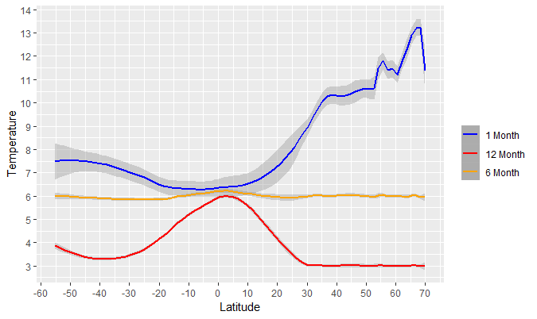

Vegetation zonation below the timberline should also be expected to reflect the growing season optima of the prevailing species, except where critical thresholds of cold or drought tolerances are exceeded. Examples can be seen where crops and tree genera associated with the temperate zone are found in the premontane and montane zones of tropical mountains where warm seasons are comparable whereas winters are very different. The greater the growing season temperature, the lower the risk in producing larger more efficient leaves. At cooler temperatures, the seasonal advantage of broadleaves is lost relative to advantage of being evergreen, maximizing the available opportunities for photosynthesis. A growing season temperature between 12 and 15°C is the transition zone between the warmer temperate deciduous and the cooler boreal evergreen forest zones, and happens also to be the limit in viability of most crops.


**Annual Extreme Low & Coldest Mean Monthly Temperature**

Cold temperature effects vegetation in two ways; it can simply be too cold for metabolic activity, or it can damage tissues. The capability of evergreens to remain functional at a lower temperature must be balanced with the risk of damage by even colder temperatures or the loss in efficiency at warmer temperatures. Mean monthly temperature below freezing offers little advantage to an evergreen and risks desiccation due to frozen soils. Therefore, most evergreens in the temperate zone have thickened needle and scale leaves with small surface areas to avoid damage.

Where the coldest monthly means remain above freezing, broadleaf evergreen vegetation can be supported. However, most broadleaf evergreens, such as those found in subtropical climates, are damaged when temperatures drop below -15°C (Prentice et al, 1992; Box, 1996; Box, 2015). Tropical vegetation is nearly intolerant of any freezing temperatures, and in some cases, can be damaged by cold a few degrees above freezing.

The Köppen-Geiger system, for comparison, delineates subtropical and oceanic climate zones where mean temperature of the coldest month exceeds 0°C, while it designates tropical climate where mean  monthly temperature exceeds 18°C. The Holdridge system does not address seasonality but rather uses annual biotemperature of 18°C and 24°C for subtropical and tropical zones respectively. The consensus among different systems maintaining subtropical or tropical climates above an 18°C threshold can be expressed by setting it as a lower limit for growing season temperature, below which an oceanic or tropical montane climate will prevail.

The oceanic climate is conflated with the tropical montane climate, without making any allowance for latitude or elevation in the classification. One possible climatic distinction is that a temperate oceanic climate is subject to annual frost, whereas the threat of frost is missing from a tropical montane climate A frost free climate is assumed for tropical montane forests by Faber-Langendoen et al (2012), but the threat of frost is assumed to be the boundary between the tropical montane and premontane forest according to Holdridge (1947) at roughly the 18°C biotemperature. In equatorial regions, occurence of frost may hold off until the 12°C subalpine zone, whereas away from the equator potential frost reaches the bottom of the 18°C montane zone. However, there are still oceanic climates along the Australian and California coasts which are nearly frost free despite having moderately cool winter mean temperatures.

Whether the zone in which broadleaf evergreens prevail should be called "warm-temperate" or "subtropical" is another issue to be resolved. Other systems, such as Köppen-Geiger, use the term "subtropical" for any warm summer climate that has its coldest winter monthly mean between 0 and 18°C. It is acknowledged, however, that the US National Vegetation Classification (Faber-Langendoen et al, 2012) has preference for the term "warm-temperate" for broadleaf evergreen vegetation largely composed of temperate zone genera. The term "subtropical" is sometimes reserved for vegetation at the fringe of the tropical zone that experiences frost, but on a less than annual basis (e.g. Box, 2015).

The synthesis of extreme cold and average cold into a single index, offset by 15 degrees, was made to emphasize the effects of winter extremes in the continental northern hemisphere, while focusing on metabolic limitations where extreme temperatures are lacking in the oceanic southern hemisphere. The modal vegetation difference between temperate (continental) and subtropical and tropical vegetation is the presence of broadleaf evergreen species and palms. Accordingly, the threshold between the subtropical and temperate (continental) climates should pivot around the more limiting value of 0°C coldest monthly temperature and -15°C extreme low temperature. The boundary between frost intolerant tropical vegetation and frost tolerant subtropical vegetation is logically set at 0°C annual extreme low temperature, with the corresponding 15°C coldest monthly mean temperature. Setting the coldest mean monthly temperature at 18°C to match the Köppen-Geiger system is not necessary, since locations like tropical south Florida, where this isotherm fits, also cooresponds to the 0°C annual extreme low isotherm. Setting the boundary as only related to extreme cold temperatures on the other hand, would result in some frost-free oceanic locations being labeled "tropical", despite a greater distance  from the equator, a greater seasonalrange in daylength, and decisively cooler (but still mild) winter temperatures.  

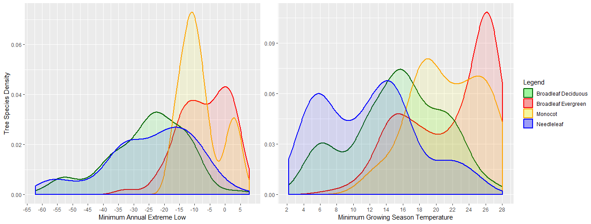

In North America, only a few broadleaf evergreen trees species occur where annual extreme lows are near -15°C , whereas a significant number of species, including palms, occur where the these temperatures exceed -13 to -10°C (unpublished analysis of data from BONAP.org and Little's Tree Atlas -- e.g. Thompson et al, 2015). However, the boundary between deciduous and broadleaf evergreen forest ecoregions in China (Olson et al, 2001) fits closely to the -15°C annual extreme low temperature boundary (Magarey, Borchert, & Schlegel, 2008).

The cold index can be tuned further to subdivide the temperate (continental) climates. While most of the zonation will pivot on limitations to growing season warmth, there are some cold season limits on groups of taxa. The hardiness of boreal species tends to be almost unlimited, whereas most temperate deciduous genera persist only down to -40°C (Prentice et al, 1992; Box 1996; Sakai & Weiser, 1973). The diversity of temperate deciduous species drops sharply where annual extreme lows fall below -25°C (Sakai & Weiser, 1973).


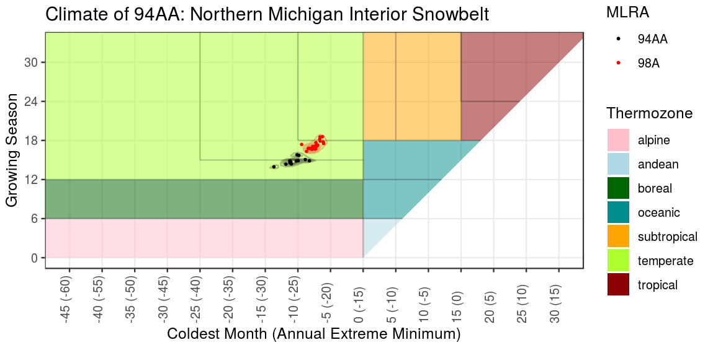


**P/PET Ratio**

Mesophytic vegetation requires a constant supply of soil moisture, whereas xerophytic vegetation tolerates periods of drought. Mesophytic forests typically occur where mean annual precipitation exceeds potential evapotranspiration ratio (P/PET ratio), meaning that seasonal dry periods are more than compensated for by seasonal surpluses stored as soil moisture to maintain plant growth. Gradations in moisture regime are usually expressed on a log base 2 scale (e.g. Holdridge), from per-humid and per-arid at its wet and dry extremes respectively.

**Surplus & Deficit**

Even in a humid climate, significant seasonal drought occurs where the cumulative loss of moisture evapotranspiration exceeds that of available soil water holding capacity within the rooting zone. A deficit of 150 mm or more is considered significant for most soils and would require adaptations of thickened leaves or deciduousness to protect a plant from drying out. Desert vegetation may occur where precipitation is less than half required to maintain soil moisture, and that significant seasonal surpluses do not support seasonal growth of mesophytic vegetation. Instead, desert vegetation must avail themselves with episodic rainfall that never wets the whole soil profile.


**Peak AET** For climates with seasonal variability in moisture, plants must employ a strategy of either tolerance or avoidance to survive the dry season. The timing of the dry season, however is of less importance compared the timing of the wet season. If the wet season coincides with temperatures favoring maximum growth, the strategy is avoidance, allowing annual regrowth of more efficient deciduous organs optimized for higher peak productivity. In contrast, if moisture is only available during periods of lower temperatures, the strategy is tolerance, allowing persistence through long periods of low productivity. In addition, when warm temperatures coincide with precipitation, the frequency of lightning is higher and fire return interval is shorter, further giving advantage to grassland vegetation over shrubland.

Actual monthly evapotranspiration (AET) is an indicator of how much precipitation of the current month is used in that month.  A minimally tropical month at 15°C would generally result in a PET of at least 75 mm. Therefore, a tropical rainy season should have a peak monthly AET of greater than or equal to 75 mm. Plants in seasonally moist climates with peak AET less than 75 mm either lack a warm season or are moist only during the cool season.Cool grasslands can prevail with peak AET less than 75 mm, though scrub-steppe vegetation usually occurs once peak AET falls below 50 mm.

It should be acknowledged that landscape roughness (slope) is a non-climate variable that interacts with climate in predicting fire frequency. Large contiguous flat expanses historically burned more frequently than areas interrupted with hills, and are thereby biased towards support of grassland vegetation.


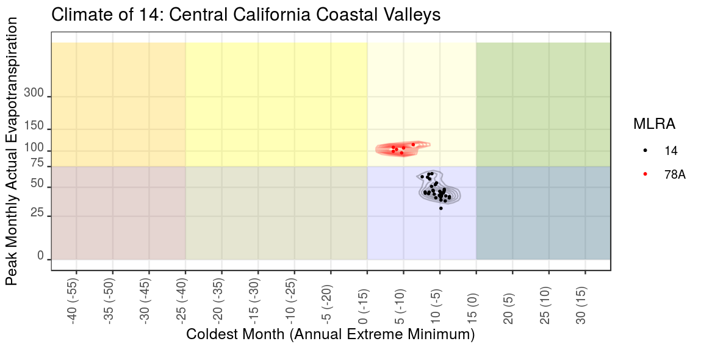

This climate classification offers key improvements over previous global climate classifications. It is a comprehensive climate classification that addresses both temperature and moisture, seasonal variability, and is global in coverage. It considers modal vegetation in determining appropriate break points but avoids overfitting by using regular intervals of the index units. It is based on scalable indices that can be aggregated or subdivided according to application needs. The indices are contiguous across different classes of climate and independent of each other such that climatic trends can be observed quantitatively one element at a time.

The Holdridge system is scalable, being based on effectively two variables that can be subdivided indefinitely and be used across different latitudes and altitudes. However, it does not resolve seasonality in temperature or precipitation regimes. The Köppen-Geiger climate classification is less useful for tropical altitudinal zonation as the categories based converge to irregularly narrow zones near 10°C and again near 22 and 18°C. It is also not scalable as few of the defining variables are used consistently across different climates. The Rivas-Martínez (2004) system is scalable, being based on several indices that could be merged or subdivided. However, the indices are not very meaningful out of context, and may not be used consistently across climates. In North America, Rivas-Martínez boundary between tropical and temperate, and humid and subhumid zones seem to deviate from established vegetation classifications (e.g. Bailey, 1998; Olsen et al, 2001; Faber-Langendoen, 2008).

Unlike the Köppen-Geiger climate classification, this classification does not depend on knowing which months are summer or winter in which hemisphere to delineate Mediterranean versus monsoonal precipitation regimes. A system which depends on knowing time of year may result in a discontinuity across the equator where the seasons are reversed. Other bioclimatic indices such as generated by Hijman et al 2005 are improvements; they identify the precipitation of the warmest quarter or temperature of the wettest quarter. However, the Hijman bioclimatic indices may still result in abrupt map discontinuities where different quarters trade ranking positions.

Prentice et al (1992) is one of the few other comprehensive classifications which incorporates the idea of plant hardiness. While the reliance on a single variable alone is not a realistic predictor of successful cultivation, horticulturalists continue to rely on hardiness zones as a filter of which plants to grow.

**Applications** Annual temperature and precipitation gives a very limited idea of how vegetation might be affected by trends, whether it be across the landscape or through time. This climate classification and related indices represent a hypothesis on the primary climatic drivers of vegetation, at least with respect to the parameters available as global data sets. Observed geographic gradients in one or more index independent of soils can in turn generate hypotheses on causal factors behind a particular vegetation type, and lead to predictions on how vegetation might behave in the future. In as much as future vegetation does not follow predicted trends, other causal phenomena can be discovered and mitigated if necessary. As vegetation patterns are studied, the primary increments in the classification could be adjusted to better match the vegetation. However, precision is not the intent in the classification, as it is more useful to discuss a range in potential vegetation types between fixed climatic benchmarks, than it is to presume a one to one relationship.


**A note on estimating annual extreme low temperatures** Most available climatic data sets consist of mean monthly values and lack enough information on temperature extremes. To estimate annual extreme low temperature, I consulted a couple of sources (Magarey, Borchert, & Schlegel, 2008; Daly et al., 2012) which generated gridded hardiness zone data. I then sampled points from these grids to associate with mean monthly temperature parameters from another gridded source of the appropriate timeframe 
(Hijmans et al., 2005; Daly et al., 2008) and developed a linear model. The linear model related annual extreme low temperatures with mean daily low temperatures, latitude, and altitude. I refined the model further by introducing a set of regional correction factors based on distance from specific latitudes and longitudes.

**A note on PET equations** Potential evapotranspiration is a function of temperature, solar radiation, relative humidity, cloud cover, wind speed, and atmospheric pressure (Lu, McNulty, & Amatya, 2005). The Holdridge method is the simplest method, by simply multiplying annual biotemperature by 58.93, but is never used for serious applications beyond climate classification. The Thornthwaite method was an earlier attempt at estimating PET that used only monthly mean temperature and used day length as a proxy for solar radiation. Formulas that use daylength for solar radiation that do not account for lower sun angles (e.g. Thornthwaite) may also over estimate PET at high latitudes with 24-hour sunshine. The interpretability monthly values using the Thornthwaite method is also complicated by division by a “heat index” which is based on an annual temperature total, rendering some values in the arctic region to be anomalously high. Priestly-Taylor method is considered among the more accurate (Lu, McNulty, & Amatya, 2005), consisting of elements of each of these factors (Details can be found here: http://www.fao.org/docrep/x0490e/x0490e07.htm#solar%20radiation or http://modeling.bsyse.wsu.edu/CS_Suite/cropsyst/manual/simulation/et/priestly_taylor.htm). Employing all the needed parameters for a global map is impracticable. Hargreaves-Samoni method reduces the number of required parameters by using daily temperature range as a proxy for cloud cover and relative humidity. I followed a hybrid approach using temperature, daily temperature range, and a formula for calculating shortwave solar radiation. I calibrated the formula against values from the Thornthwaite method in the north temperate zone where it is widely employed. This approach falls short of the Thornthwaite method in cool or humid climates, and exceeds it in arid regions with wide daily temperature ranges.

***
##Keys to Climate Classification

###Macrothermoclimate

* 1a. Tc ≥ 0°C and Tclx ≥ -15°C
    * 2a. Tg ≥ 18°C
        * 3a. Tc ≥ 15°C and Tclx ≥ 0°C  ... **Tropical**
        * 3b. Tc < 15°C or Tclx < 0°C ... **Subtropical**
    * 2b. Tg < 18°C
        * 4a. Tg ≥ 6°C  ...  **Oceanic**
        * 4b. Tg < 6°C  ...  **Andean**
* 1b. Tc ≥ 0° C or Tclx < -15°C
    * 5a. Tg ≥ 12°C  ...  **Temperate**
    * 5b. Tg < 12°C
        * 6a. Tg ≥ 6°C  ...  **Boreal**
        * 6b. Tg < 6°C  ...  **Arctic**

###Macrombroclimate


* 1a. Annual P/PET ratio ≥ 1 and total monthly deficit < 150 mm   ...   **Isopluvial**
* 1b. Annual P/PET ratio < 1 or total monthly deficit ≥ 150 mm
    * 2a. Annual P/PET ratio > 0.5 or total monthly surplus ≥ 25 mm
        * 3a. peak AET ≥ 75 mm (monsoonal with rainfall occurring with warm weather)   ...   **Pluviothermic**
        * 3b. peak AET < 75 mm (Mediterranean with drought occurring with warm weather and precipitation occurring with cool weather)   ...   **Xerothermic**
    * 2b. Annual P/PET ratio < 0.5 and total monthly surplus < 25 mm
        * 4a. peak AET ≥ 75 mm (monsoonal rainfall)   ...   **Pluvioxeric**
        * 4b. peak AET < 75 mm (no significant peak in rainfall) ...   **Isoxeric**

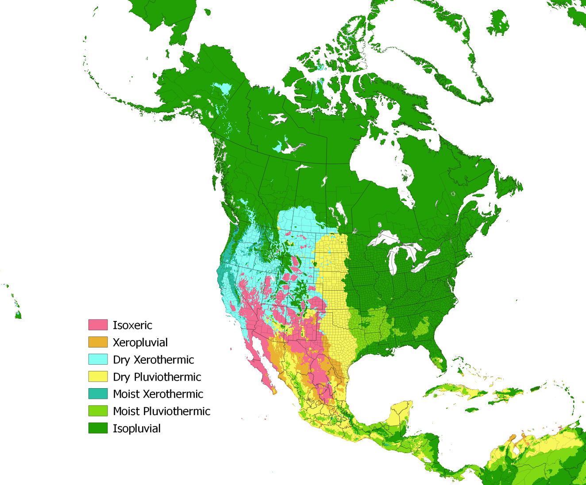

###Moisture Zones

* 1a. Annual P/PET ratio ≥ 2 ... **Perhumid**
* 1b. Annual P/PET ratio < 2
    * 2a. Annual P/PET ratio ≥ 1.414 ... **Moist Humid**
    * 2b. Annual P/PET ratio < 1.414
        * 3a. Annual P/PET ratio ≥ 1 ... **Dry Humid**
        * 3b. Annual P/PET ratio < 1
            * 4a. Annual P/PET ratio ≥ 0.707 ... **Moist Subhumid**
            * 4b. Annual P/PET ratio < 0.707
                * 5a. Annual P/PET ratio ≥ 0.5 ... **Dry Subhumid**
                * 5b. Annual P/PET ratio < 0.5
                    * 6a. Annual P/PET ratio ≥ 0.25 ... **Semiarid**
                    * 6b. Annual P/PET ratio < 0.25
                        * 7a. Annual P/PET ratio ≥ 0.125 ... **Arid**
                        * 7b. Annual P/PET ratio < 0.125 ... **Perarid**

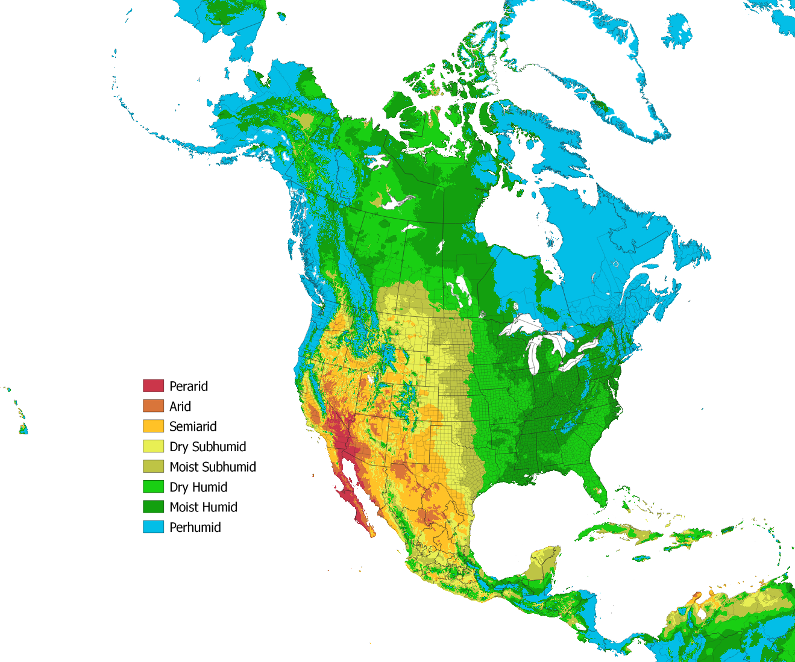

###Temperature Regime
* 1a. Tc ≥ 0°C and Tclx ≥ -15°C
    * 2a. Tg ≥ 18°C
        * 3a. Tc ≥ 15°C and Tclx ≥ 0°C ... **Tropical**
            * Tg ≥ 24°C
                * Tc ≥ 20°C and Tclx ≥ 5°C ... **Hot Mesotropical**
                * Tc < 20°C or Tclx < 5°C ... **Hot Cryotropical**
            * Tg < 24°C ... **Premontane Tropical**
        * 3b. Tc < 15°C or Tclx < 0°C ... **Subtropical**
            * Tc ≥ 10°C and Tclx ≥ -5°C
                * Tg ≥ 24°C ... **Hot Thermosubtropical**
                * Tg < 24°C ... **Warm Thermosubtropical**
            * Tc < 10°C or Tclx < -10°C
                * Tc ≥ 5°C and Tclx ≥ -10°C
                    * Tg ≥ 24°C ... **Hot Mesosubtropical**
                    * Tg < 24°C ... **Warm Mesosubtropical**
                * Tc < 5°C or Tclx < -10°C
                    * Tg ≥ 24°C ... **Hot Cryosubtropical**
                    * Tg < 24°C ... **Warm Cryosubtropical**
    * 2b. Tg < 18°C
        * 4a. Tg ≥ 6°C ... Oceanic
            * Tg ≥ 12°C
                * Tc ≥ 5°C and Tclx ≥ -10°C ... **Montane Subtropical**
                * Tc < 5°C or Tclx < -10°C ... **Mild Oceanic**
            * Tg < 12°C
                * Tc ≥ 5°C and Tclx ≥ -5°C ... **Subandean**
                * Tc < 5°C or Tclx < -10°C ... **Cool Oceanic**
        * 4b. Tg < 6°C ... Andean
* 1b. Tc ≥ 0° C or Tclx < -15°C
    * 5a. Tg ≥ 12°C ...... Temperate
        * Tc ≥ -10°C or Tclx ≥ -25°C
            * Tg ≥ 18°C
                * Tc ≥ -5°C or Tclx ≥ -20°C ... **Warm Thermotemperate**
                * Tc < -5°C or Tclx < -20°C ... **Warm Mesotemperate**
            * Tg < 18°C
                * Tg ≥ 15°C ... **Mild Temperate**
                * Tg < 15°C ... **Presubalpine**
        * Tc < -10°C or Tclx < -25°C
            * Tc ≥ -25°C or Tclx ≥ -40°C
                * Tg ≥ 15°C
                    * Tg ≥ 18°C ... **Warm Cryotemperate**
                    * Tg < 18°C ... **Mild Cryotemperate**
                * Tg < 15°C ... **Hemiboreal**
            * Tc < -10°C or Tclx < -25°C ... **Warm Boreal**
      * 5b. Tg < 12°C
        * 6a. Tg ≥ 6°C ... Boreal
            * Tc ≥ -10°C and Tclx ≥ -25°C ... **Subalpine**
            * Tc < -10°C or Tclx < -25°C ... **Cool Boreal**
        * 6b. Tg < 6°C ... Arctic
            * Tc ≥ -10°C and Tclx ≥ -25°C ... **Alpine**
            * Tc < -10°C or Tclx < -25°C ... **Arctic**
            
            
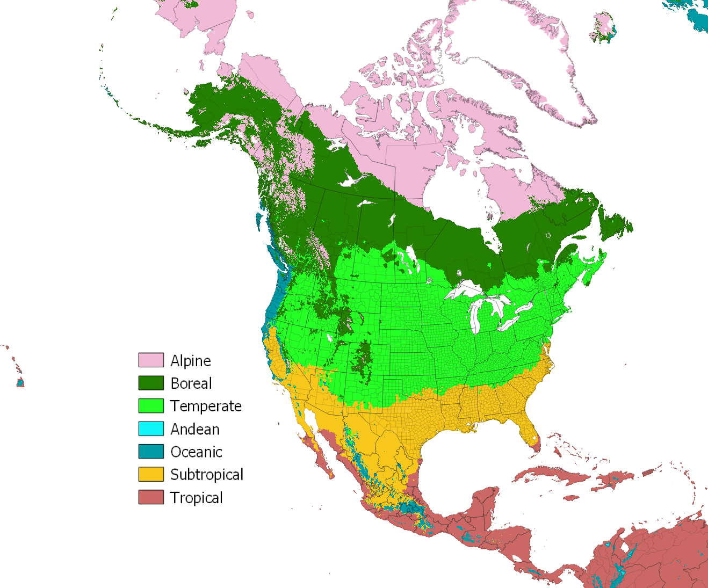

###General Climate Map Legend
* 1a. Tc ≥ 0°C and Tclx ≥ -15°C
    * 2a. Tg ≥ 18°C
        * 3a. Tc ≥ 15°C and Tclx ≥ 0°C  ... **Tropical**
            * Annual P/PET ratio ≥ 1 and total monthly deficit < 150 mm
                * Tg ≥ 24  ...   **731 Hot Tropical Isopluvial Humid -- Tropical Lowland Moist Forest**
                * Tg < 24  ...   **730 Warm Tropical Isopluvial Humid -- Tropical Premontane Moist Forest**
            * Annual P/PET ratio < 1 or total monthly deficit ≥ 150 mm
                * Annual P/PET ratio ≥ 0.5 or total monthly surplus ≥ 25 mm
                    * Annual P/PET ratio ≥ 1 ...   **720-721 Tropical Pluviothermic Humid -- Tropical Seasonal/Monsoon Forest**
                    * Annual P/PET ratio < 1 ...   **710-711 Tropical Pluviothermic Subhumid -- Tropical Dry Forest/Savanna**
                * Annual P/PET ratio < 0.5 and total monthly surplus < 25 mm
                    * peak AET ≥ 75 mm ...   **701 Tropical Pluvioxeric -- Tropical Thornscrub**
                    * peak AET < 75 mm ...   **700 Tropical Isoxeric -- Tropical Desert**
        * 3b. Tc < 15°C or Tclx < 0°C ... **Subtropical**
            * Annual P/PET ratio ≥ 1 and total monthly deficit < 150 mm
                * Tc ≥ 5° C and Tclx ≥ -10°C  ...   **631 Eu-Subtropical Isopluvial Humid -- Subtropical Evergreen Forest**
                * Tc < 5° C or Tclx < -10°C  ...   **630 Cryo-subtropical Isopluvial Humid -- Subtropical Mixed Evergreen Forest**
            * Annual P/PET ratio < 1 or total monthly deficit ≥ 150 mm
                * Annual P/PET ratio ≥ 0.5 or total monthly surplus ≥ 25 mm
                    * Peak AET ≥ 75 mm.
                        * Annual P/PET ratio ≥ 1 ...   **621 Subtropical Pluviothermic Humid -- Subtropical Woodland/Savanna**
                        * Annual P/PET ratio < 1 ...   **611 Subtropical Pluviothermic Subhumid -- Subtropical Grassland/Prairie**
                    * Peak AET < 75 mm.
                        * Annual P/PET ratio ≥ 1 ...   **620 Subtropical Xerothermic Humid -- Subtropical Sclerophyllous Forest**
                        * Annual P/PET ratio < 1 ...   **610 Subtropical Xerothermic Subhumid -- Subtropical Sclerophyllous Shrubland**
                * Annual P/PET ratio < 0.5 and total monthly surplus < 25 mm
                    * peak AET ≥ 75 mm ...   **601 Subtropical Pluvioxeric -- Subtropical Thornscrub**
                    * peak AET < 75 mm ...   **600 Subtropical Isoxeric -- Subtropical Desert**
    * 2b. Tg < 18°C
        * 4a. Tg ≥ 6°C  ...  **Oceanic**
            * Annual P/PET ratio ≥ 1 and total monthly deficit < 150 mm
                * Tg ≥ 12°C  ...   **531 Mild Oceanic Isopluvial Humid -- Mild Oceanic/Tropical Montane Moist Forest**
                * Tg < 12°C  ...   **530 Cool Oceanic Isopluvial Humid -- Cool Oceanic/Tropical Subalpine Moist Forest**
            * Annual P/PET ratio < 1 or total monthly deficit ≥ 150 mm
                * Annual P/PET ratio ≥ 0.5 or total monthly surplus ≥ 25 mm
                    * Peak AET ≥ 75 mm.
                        * Annual P/PET ratio ≥ 1 ...   **521 Oceanic Pluviothermic Humid -- Subtropical Montane Seasonal Forest**
                        * Annual P/PET ratio < 1 ...   **511 Oceanic Pluviothermic Subhumid -- Subtropical Montane Seasonal Woodland**
                    * Peak AET < 75 mm.
                        * Annual P/PET ratio ≥ 1 ...   **520 Oceanic Xerothermic Humid -- Oceanic Sclerophyllous Forest**
                        * Annual P/PET ratio < 1 ...   **510 Oceanic Xerothermic Subhumid -- Oceanic Sclerophyllous Shrubland**
                * Annual P/PET ratio < 0.5 and total monthly surplus < 25 mm
                    * peak AET ≥ 75 mm ...   **501 Oceanic Pluvioxeric -- Oceanic Desert-Grassland**
                    * peak AET < 75 mm ...   **500 Oceanic Isoxeric -- Oceanic Desert**

        * 4b. Tg < 6°C  ...  **Andean**
            * Annual P/PET ratio ≥ 1  ...  **420-430 Andean Humid -- Paramos**
            * Annual P/PET ratio < 1  ...  **400-410 Andean Subhumid -- Puna**
* 1b. Tc ≥ 0° C or Tclx < -15°C
    * 5a. Tg ≥ 12°C  ...  **Temperate**
        * Annual P/PET ratio ≥ 1 and total monthly deficit < 150 mm
            * Tg ≥ 18°C and Tc ≥ -10° C and Tclx ≥ -25°C  ...   **332 Warm Thermo-temperate Isopluvial Humid -- Warm Temperate Deciduous Forest**
            * Tg < 18°C or Tc ≥ -10° C or Tclx > -25°C
                * Tg ≥ 15°C and Tc ≥ -25° C or Tclx > -40°C  ...   **331 Mild Meso-temperate Isopluvial Humid -- Mild Temperate Deciduous/Mixed Forest**
                * Tg < 15°C or Tc < -25° C or Tclx < -40°C  ...   **330 Mild Cryo-temperate Isopluvial Humid -- Hemiboreal Mixed Forest**
        * Annual P/PET ratio < 1 or total monthly deficit ≥ 150 mm
            * Annual P/PET ratio ≥ 0.5 or total monthly surplus ≥ 25 mm
                * Peak AET ≥ 75 mm.
                    * Annual P/PET ratio ≥ 1 ...   **321 Temperate Pluviothermic Humid -- Temperate Woodland/Savanna**
                    * Annual P/PET ratio < 1 ...   **311 Temperate Pluviothermic Subhumid -- Temperate Grassland**
                * Peak AET < 75 mm.
                    * Annual P/PET ratio ≥ 1 ...   **320 Temperate Xerothermic Humid -- Temperate Dry Evergreen Forest**
                    * Annual P/PET ratio < 1 ...   **310 Temperate Xerothermic Subhumid -- Temperate Steppe/Shrub-Steppe**
            * Annual P/PET ratio < 0.5 and total monthly surplus < 25 mm
                * peak AET ≥ 75 mm ...   **301 Temperate Pluvioxeric -- Temperate Desert-Grassland**
                * peak AET < 75 mm ...   **300 Temperate Isoxeric -- Temperate Desert**

    * 5b. Tg < 12°C
        * 6a. Tg ≥ 6°C  ...  **Boreal**
            * Annual P/PET ratio ≥ 1  ...  **220-230 Boreal Humid -- Boreal Forest**
            * Annual P/PET ratio < 1  ...  **200-211 Boreal Subhumid -- Cool Shrubland**
        * 6b. Tg < 6°C  ...  **Arctic**
            * Annual P/PET ratio ≥ 1  ...  **120-130 Arctic Humid -- Wet Tundra**
            * Annual P/PET ratio < 1  ...  **100-111 Arctic Subhumid -- Dry Tundra**

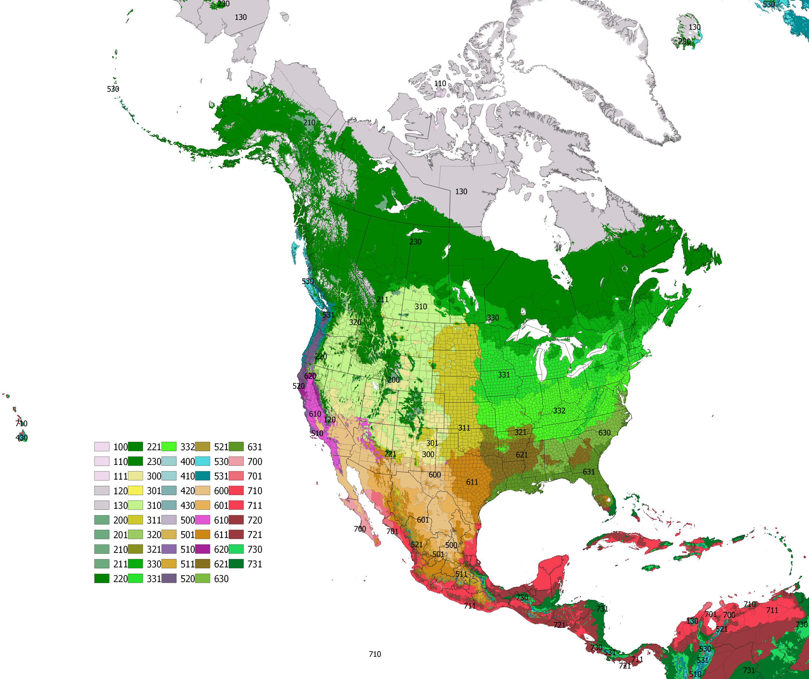


***          
###Variables and formulae as used in the keys above

**Tc** = mean temperature of the coldest month

**Tg** = mean positive (subzero temperatures counted as zero) temperature of the warmest 6 months

**P** = precipitation

**AET** = lesser value among monthly P and PET, approximating “actual evapotranspiration” without considering effects of soil moisture storage or runoff. **Peak AET** is the month with the highest value of AET.

**Deficit** = total monthly deficit is calculated by summing for the entire year each monthly amount of PET in excess of P (subtract P from PET if P is less than PET; zero if P ≥ PET).

**Surplus** = total monthly surplus is calculated by summing for the entire year each monthly amount of P in excess of PET (subtract PET from P if PET is less than P; zero if P <= PET).

####Monthly potential evapotranspiration:
$$PET = 0.008404 * 216.7*\frac{exp(17.26939*\frac{T}{T+237.3})}{T+273.3}*Ra*dM*(Tmax-Tmin)^{0.5}$$

*where*

**Declination:** $dec = 0.409*sin(2*\pi*Md/365 – 1.39)$

**Sunset Angle:** $hs = acos(-tan(Latitude/360*2*\pi) * tan(declination)) [-1\to 1]$

**Potential Solar Radiation:** $Ra = 117.5 * (hs*sin(Latitude/360*2*\pi)*sin(dec) + cos(Latitude/360*2*\pi)*cos(dec)*sin(hs)) /\pi$

**T** = mean monthly temperature

**Tmax** = mean monthly daily high temperature

**Tmin** = mean monthly daily low temperature

**Md** = mid-month day of year

**dM** = total days in month

**Simple approximation of monthly PET:** $$PET = 5 * BT$$

*where*

**BT** = positive mean monthly temperature $[0\to\infty]$ (values below zero set to zero) or “biotemperature”.

####Mean annual extreme low temperature (approximated):
$Tclx = -9.921 + 1.248*Tcl + -0.03829*L + 0.000904*A + -0.0000219 * L*A$

*where*

**Tcl** = low temperature of coldest month

**L** = latitude

**A** = altitude above sea-level


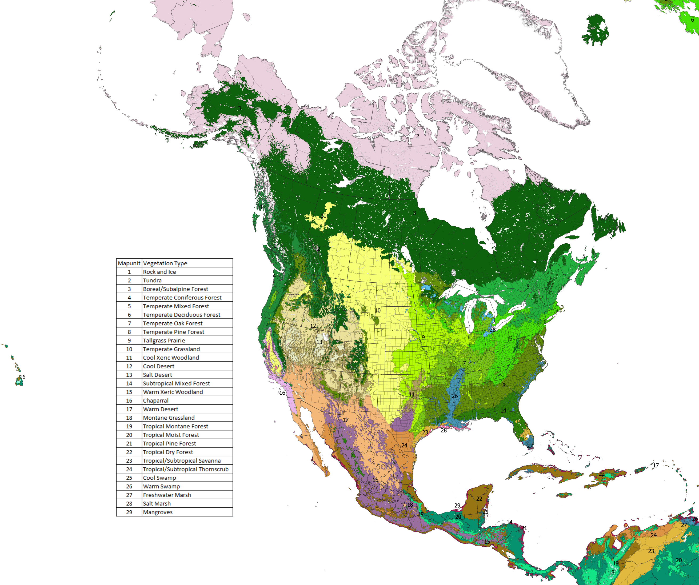

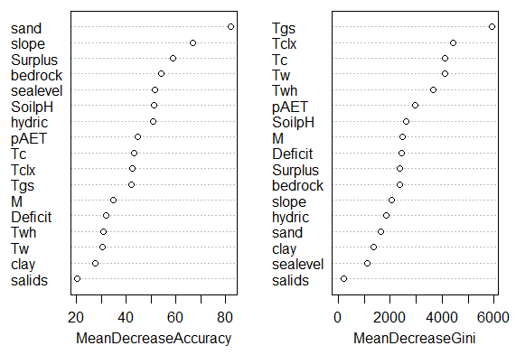

Variables in Figure 13:
Tgs = growing season temperature;
Tc = coldest monthly temperature;
Tclx = extreme annual low temperature;
pAET = peak monthly evapotranspiration;
M = precipitation/potential evapotranspration ratio;
SoilpH = soil pH;
Surpus = cumulative annual precipitation surplus above monthly need;
Deficit = cumulative annual precipitation deficit above monthly need;
slope = mean slope;
hyrdic = percent wetland soils;
sand = percent sand (0-60 cm);
clay = percent clay (0-15 cm);
sealevel = combined index of elevation and proximity to the coast for coastal vegetation;
salids = percent saline desert soils; 
Tw = warmest monthly temperature;
Tw = warmest monthly high temperature;
bedrock = percent of soils with bedrock within 2 m.

Vegetation was classified based on GIS data associated with World Wildlife Fund ecoregions (Olsen et al, 2001) and Kuchler potential natural vegetation (Kuchler, 1964). Some biomes were subdivided by overlaying a map by Brown et al (1995) to show thornscrub as separate from warm deserts and tropical dry forests. Portions of "tropical moist forest" mapped as "semi-evergreen forest" by Brown et al (1995) were reclassified as "tropical dry forest", and were indeed in a subhumid climate zone. Over all this resulted in a shift in the areas mapped tropical dry forest from dry to moist. Chaparral vegetation was recognized beyond California. Only areas of tropical coniferous forest that occurred in lowlands were put in a group call tropical pine forest. Areas of Mexico pine-oak woodlands, Texas oak woodlands, and California oak woodlands were grouped as "warm xeric woodlands". The highest elevations in Mexico were recognized by Brown et al (1995) as an extension "montane conifer forest" and are here considered "temperate coniferous forest"" by their presence of fir. Some subdivision of desert vegetation based on grass cover was considered, but not undertaken. Semi-desert grasslands were maintained in "warm desert". Shrub-steppe was maintained as part of "cool desert". Pinyon-juniper woodlands and crosstimbers were treated as "cool xeric woodlands".

***
###Alternative General Climate Map Legend

The pAET threshold for cold winter climates was reduced to 50 mm to accommodate the steppe vegetation in the high plains of North America, below the 75 mm threshold. Below 50 mm, the vegetation has more shrubs. The deficit threshold was increased to 300 mm because tropical forests maintain evergreen status well past the 150 mm threshold. The vegetation becomes more seasonal (deciduous, semi-deciduous, or semi-evergreen) when deficits are above 300 mm or when the P/PET ratio falls below 1, which means that soil is unable to store enough moisture even for deep rooted species.

* 1a. Tc ≥ 0°C and Tclx ≥ -15°C
    * 2a. Tg ≥ 18°C
        * 3a. Tc ≥ 15°C and Tclx ≥ 0°C  ... **Tropical**
            * Annual P/PET ratio ≥ 1 and total monthly deficit < 300 mm
                * Tg ≥ 24  ...   **731 Hot Tropical Isopluvial Humid -- Tropical Lowland Moist Forest**
                * Tg < 24  ...   **730 Warm Tropical Isopluvial Humid -- Tropical Premontane Moist Forest**
            * Annual P/PET ratio < 1 or total monthly deficit ≥ 300 mm
                * Annual P/PET ratio ≥ 0.5 or total monthly surplus ≥ 25 mm
                    * Annual P/PET ratio ≥ 1 ...   **720-722 Tropical Pluviothermic Humid -- Tropical Seasonal/Monsoon Forest**
                    * Annual P/PET ratio < 1 ...   **710-712 Tropical Pluviothermic Subhumid -- Tropical Dry Forest/Savanna**
                * Annual P/PET ratio < 0.5 and total monthly surplus < 25 mm
                    * peak AET ≥ 75 mm ...   **702 Tropical Pluvioxeric -- Tropical Thornscrub**
                    * peak AET < 75 mm ...   **700-701 Tropical Isoxeric -- Tropical Desert**
        * 3b. Tc < 15°C or Tclx < 0°C ... **Subtropical**
            * Annual P/PET ratio ≥ 1 and total monthly deficit < 300 mm
                * Tc ≥ 5° C and Tclx ≥ -10°C  ...   **631 Eu-Subtropical Isopluvial Humid -- Subtropical Evergreen Forest**
                * Tc < 5° C or Tclx < -10°C  ...   **630 Cryo-subtropical Isopluvial Humid -- Subtropical Mixed Evergreen Forest**
            * Annual P/PET ratio < 1 or total monthly deficit ≥ 300 mm
                * Annual P/PET ratio ≥ 0.5 or total monthly surplus ≥ 25 mm
                    * Peak AET ≥ 75 mm.
                        * Annual P/PET ratio ≥ 1 ...   **622 Subtropical Pluviothermic Humid -- Subtropical Woodland/Savanna**
                        * Annual P/PET ratio < 1 ...   **612 Subtropical Pluviothermic Subhumid -- Subtropical Grassland/Prairie**
                    * Peak AET < 75 mm.
                        * Annual P/PET ratio ≥ 1 ...   **620-621 Subtropical Xerothermic Humid -- Subtropical Sclerophyllous Forest**
                        * Annual P/PET ratio < 1 ...   **610-611 Subtropical Xerothermic Subhumid -- Subtropical Sclerophyllous Shrubland**
                * Annual P/PET ratio < 0.5 and total monthly surplus < 25 mm
                    * peak AET ≥ 75 mm ...   **602 Subtropical Pluvioxeric -- Subtropical Thornscrub**
                    * peak AET < 75 mm ...   **600-601 Subtropical Isoxeric -- Subtropical Desert**
    * 2b. Tg < 18°C
        * 4a. Tg ≥ 6°C  ...  **Oceanic**
            * Annual P/PET ratio ≥ 1 and total monthly deficit < 300 mm
                * Tg ≥ 12°C  ...   **532 Mild Oceanic Isopluvial Humid -- Mild Oceanic/Tropical Montane Moist Forest**
                * Tg < 12°C  ...   **530-531 Cool Oceanic Isopluvial Humid -- Cool Oceanic/Tropical Subalpine Moist Forest**
            * Annual P/PET ratio < 1 or total monthly deficit ≥ 300 mm
                * Annual P/PET ratio ≥ 0.5 or total monthly surplus ≥ 25 mm
                    * Peak AET ≥ 75 mm.
                        * Annual P/PET ratio ≥ 1 ...   **522 Oceanic Pluviothermic Humid -- Subtropical Montane Seasonal Forest**
                        * Annual P/PET ratio < 1 ...   **512 Oceanic Pluviothermic Subhumid -- Subtropical Montane Seasonal Woodland**
                    * Peak AET < 75 mm.
                        * Annual P/PET ratio ≥ 1 ...   **520-521 Oceanic Xerothermic Humid -- Oceanic Sclerophyllous Forest**
                        * Annual P/PET ratio < 1 ...   **510-511 Oceanic Xerothermic Subhumid -- Oceanic Sclerophyllous Shrubland**
                * Annual P/PET ratio < 0.5 and total monthly surplus < 25 mm
                    * peak AET ≥ 75 mm ...   **502 Oceanic Pluvioxeric -- Oceanic Desert-Grassland**
                    * peak AET < 75 mm ...   **500-501 Oceanic Isoxeric -- Oceanic Desert**

        * 4b. Tg < 6°C  ...  **Andean**
            * Annual P/PET ratio ≥ 1  ...  **420-430 Andean Humid -- Paramos**
            * Annual P/PET ratio < 1  ...  **400-410 Andean Subhumid -- Puna**
* 1b. Tc ≥ 0° C or Tclx < -15°C
    * 5a. Tg ≥ 12°C  ...  **Temperate**
        * Annual P/PET ratio ≥ 1 and total monthly deficit < 300 mm
            * Tg ≥ 18°C and Tc ≥ -10° C and Tclx ≥ -25°C  ...   **332 Warm Thermo-temperate Isopluvial Humid -- Warm Temperate Deciduous Forest**
            * Tg < 18°C or Tc ≥ -10° C or Tclx > -25°C
                * Tg ≥ 15°C and Tc ≥ -25° C or Tclx > -40°C  ...   **331 Mild Meso-temperate Isopluvial Humid -- Mild Temperate Deciduous/Mixed Forest**
                * Tg < 15°C or Tc < -25° C or Tclx < -40°C  ...   **330 Mild Cryo-temperate Isopluvial Humid -- Hemiboreal Mixed Forest**
        * Annual P/PET ratio < 1 or total monthly deficit ≥ 300 mm
            * Annual P/PET ratio ≥ 0.5 or total monthly surplus ≥ 25 mm
                * Peak AET ≥ 50 mm.
                    * Annual P/PET ratio ≥ 1 ...   **321-322 Temperate Pluviothermic Humid -- Temperate Woodland/Savanna**
                    * Annual P/PET ratio < 1 ...   **311-312 Temperate Pluviothermic Subhumid -- Temperate Grassland**
                * Peak AET < 50 mm.
                    * Annual P/PET ratio ≥ 1 ...   **320 Temperate Xerothermic Humid -- Temperate Dry Evergreen Forest**
                    * Annual P/PET ratio < 1 ...   **310 Temperate Xerothermic Subhumid -- Temperate Steppe/Shrub-Steppe**
            * Annual P/PET ratio < 0.5 and total monthly surplus < 25 mm
                * peak AET ≥ 50 mm ...   **301-302 Temperate Pluvioxeric -- Temperate Desert-Grassland**
                * peak AET < 50 mm ...   **300 Temperate Isoxeric -- Temperate Desert**

    * 5b. Tg < 12°C
        * 6a. Tg ≥ 6°C  ...  **Boreal**
            * Annual P/PET ratio ≥ 1  ...  **220-230 Boreal Humid -- Boreal Forest**
            * Annual P/PET ratio < 1  ...  **200-211 Boreal Subhumid -- Cool Shrubland**
        * 6b. Tg < 6°C  ...  **Arctic**
            * Annual P/PET ratio ≥ 1  ...  **120-130 Arctic Humid -- Wet Tundra**
            * Annual P/PET ratio < 1  ...  **100-112 Arctic Subhumid -- Dry Tundra**

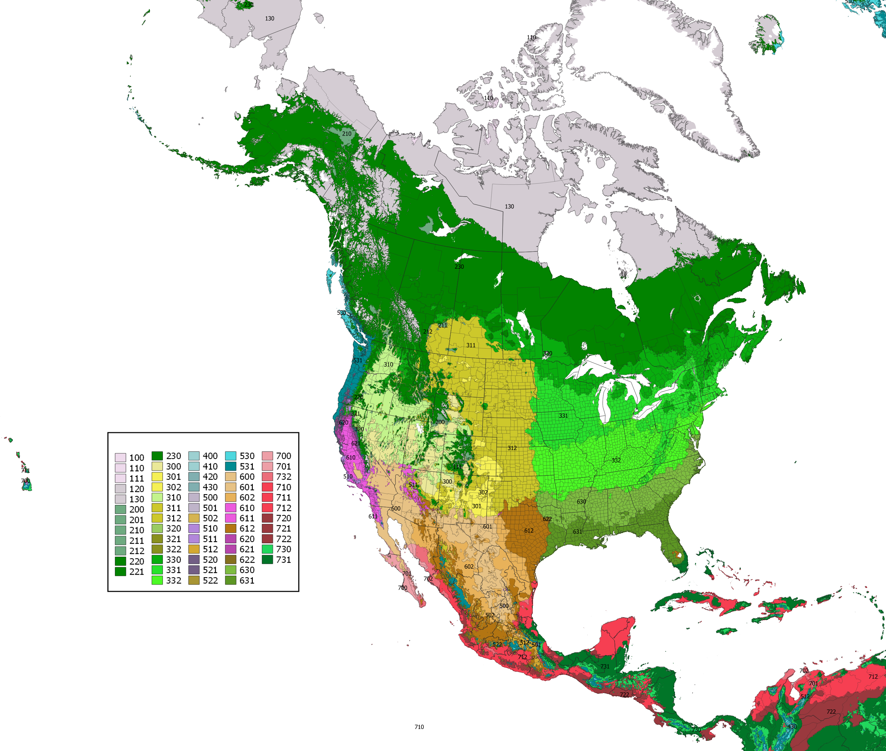

###References

####Climate maps are derived from these raster GIS data sources: 

Daly, C., Halbleib, M., Smith, J.I., Gibson, W.P., Doggett, M.K., Taylor, G.H., Curtis, J., and Pasteris, P.A. 2008. Physiographically-sensitive mapping of temperature and precipitation across the conterminous United States. International Journal of Climatology, 28: 2031-2064. (http://prism.oregonstate.edu/normals/) 

Daly, C., Widrlechner, M.P., Halbleib, M.D., Smith, J.I. and Gibson, W.P., 2012. Development of a new USDA plant hardiness zone map for the United States. Journal of Applied Meteorology and Climatology, 51(2), pp.242-264. 

Hijmans, R.J., S.E. Cameron, J.L. Parra, P.G. Jones and A. Jarvis, 2005. Very high resolution interpolated climate surfaces for global land areas. International Journal of Climatology 25: 1965-1978. (http://www.worldclim.org/version1) 

Magarey, R.D., Borchert, D.M. and Schlegel, J.W., 2008. Global plant hardiness zones for phytosanitary risk analysis. Scientia Agricola, 65(SPE), pp.54-59. 


####Alternative Climate Classifications: 

Holdridge, L.R., 1947. Determination of world plant formations from simple climatic data. Science, 105(2727), pp.367-368. 

Lugo, A.E., Brown, S.L., Dodson, R., Smith, T.S. and Shugart, H.H., 1999. The Holdridge life zones of the conterminous United States in relation to ecosystem mapping. Journal of biogeography, 26(5), pp.1025-1038. 

Kottek, M., Grieser, J., Beck, C., Rudolf, B. and Rubel, F., 2006. World map of the Köppen-Geiger climate classification updated. Meteorologische Zeitschrift, 15(3), pp.259-263. 

Rivas-Martínez, S., 2004. Global bioclimatics. Classificación Bioclimática de la Tierra. http://www.globalbioclimatics.org/form/maps.htm 

Thornthwaite, C.W., 1948. An approach toward a rational classification of climate. Geographical review, 38(1), pp.55-94. 

####Alternative PET calculations: 

Lu, J., Sun, G., McNulty, S.G. and Amatya, D.M., 2005. A comparison of six potential evapotranspiration methods for regional use in the southeastern United States 1. JAWRA Journal of the American Water Resources Association, 41(3), pp.621-633. 

####Publications related to vegetation: 

Bailey, R.G., 1998. Ecoregions of North America (No. 1548). US Department of Agriculture, Forest Service. 

Box, E.O., 1996. Plant functional types and climate at the global scale. Journal of Vegetation Science, 7(3), pp.309-320. 

Box, E.O., 2015. Quantitative delimitation of warm-temperate deciduous forest areas. In: E.O. Box and K. Fujiwara (Eds), Warm-Temperate Deciduous Forests around the Northern Hemisphere (pp. 277-284). Springer.

Brown, D.E., Reichenbacher, F. and Franson, S.E., 1995. A classification system and map of the biotic communities of North America. Biodiversity and management of the Madrean archipelago: The sky islands of southwestern United States and northwestern Mexico.

Faber-Langendoen, D.; Keeler-Wolf, T.; Meidinger, D.; Josse, C.; Weakley, A.; Tart, D.; Navarro, G.; Hoagland, B.; Ponomarenko, S.; Saucier, JP; Fults, G.; Helmer, E. 2012. Classification and description of world formation types. Part II (Description of formation types). Hierarchy Revisions Working Group, Federal Geographic Data Committee, FGDC Secretariat, US Geological Survey and NatureServe, Reston, VA and Arlington, VA. http://usnvc.org/explore-classification/

Körner, C., 1998. A re-assessment of high elevation treeline positions and their explanation. Oecologia, 115(4), pp.445-459.

Kuchler, A.W. 1964. Potential Natural Vegetation of the Conterminous United States. American Geographical Society, Special Publication No. 36

Thompson, R.S., Anderson, K.H., Pelltier, R.T., Strickland, L.E., Shafer, S.L., Bartlein, P.J. and McFadden, A.K., 2015. Atlas of relations between climatic parameters and distributions of important trees and shrubs in North America: Revisions for all taxa from the United States and Canada and new taxa from the western United States. US Department of the Interior, US Geological Survey. https://pubs.usgs.gov/pp/p1650-g/

Olson, D.M., Dinerstein, E., Wikramanayake, E.D., Burgess, N.D., Powell, G.V., Underwood, E.C., D'amico, J.A., Itoua, I., Strand, H.E., Morrison, J.C. and Loucks, C.J., 2001. Terrestrial Ecoregions of the World: A New Map of Life on Earth: A new global map of terrestrial ecoregions provides an innovative tool for conserving biodiversity. BioScience, 51(11), pp.933-938.

Prentice, I.C., Cramer, W., Harrison, S.P., Leemans, R., Monserud, R.A. and Solomon, A.M., 1992. Special paper: a global biome model based on plant physiology and dominance, soil properties and climate. Journal of biogeography, pp.117-134. 

Sakai, A., 1981. Freezing resistance of broad-leaved evergreen trees in the warm-temperate zone. Low temperature Science. Ser. B, Biological sciences, 38, pp.1-14. 

Sakai, A. and Weiser, C.J., 1973. Freezing resistance of trees in North America with reference to tree regions. Ecology, 54(1), pp.118-126.

Schenk, H.J. and Jackson, R.B., 2002. The global biogeography of roots. Ecological monographs, 72(3), pp.311-328. 

Wright, I.J., Dong, N., Maire, V., Prentice, I.C., Westoby, M., Díaz, S., Gallagher, R.V., Jacobs, B.F., Kooyman, R., Law, E.A. and Leishman, M.R., 2017. Global climatic drivers of leaf size. Science, 357(6354), pp.917-921.

***
###Appendix: Climate Browsers

***
The **MLRA Climate Browser** (https://usda.shinyapps.io/MLRAClimate/) allows a user to compare climates of up to two different MLRAs at a time for various climatic parameters. The default monthly temperature and precipitation graph shows the relationship of precipitation with potential evapotranspiration. Both precipitation and temperature include error bars indicating the lowest and highest 6 out of 30-year record (20th and 80th percentiles) among the stations within the MLRA (shows both temporal and geographic variability).

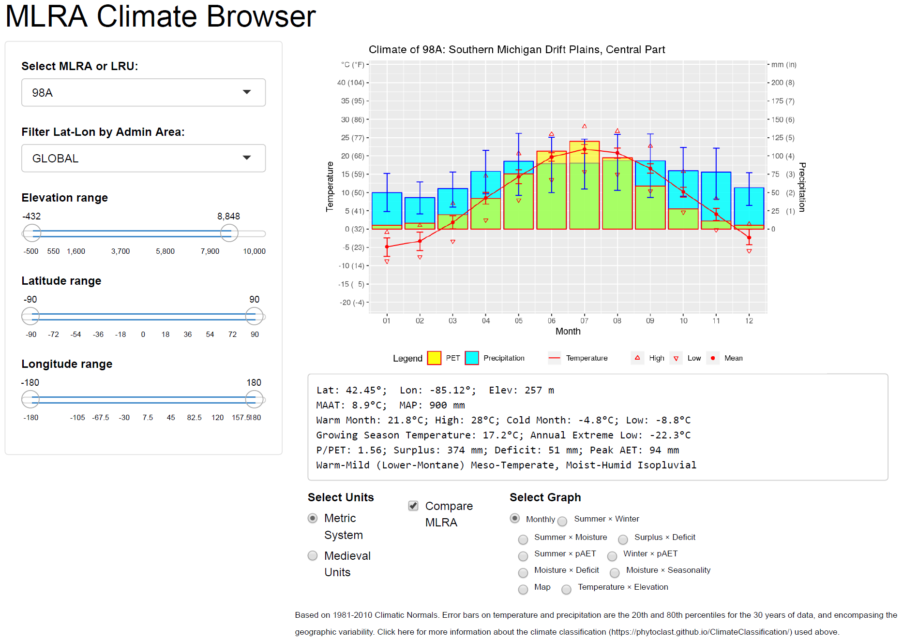


***
The **Biome Climate Browser** (https://phytoclast.shinyapps.io/BioClimR/) allows a user to explore the climates of different World Wildlife Fund ecoregions globally (except Antarctica). Options exist to explore alternative time frames in the past and the future.


