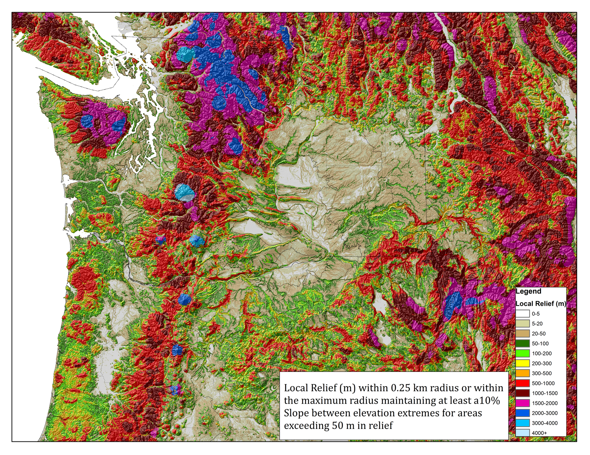
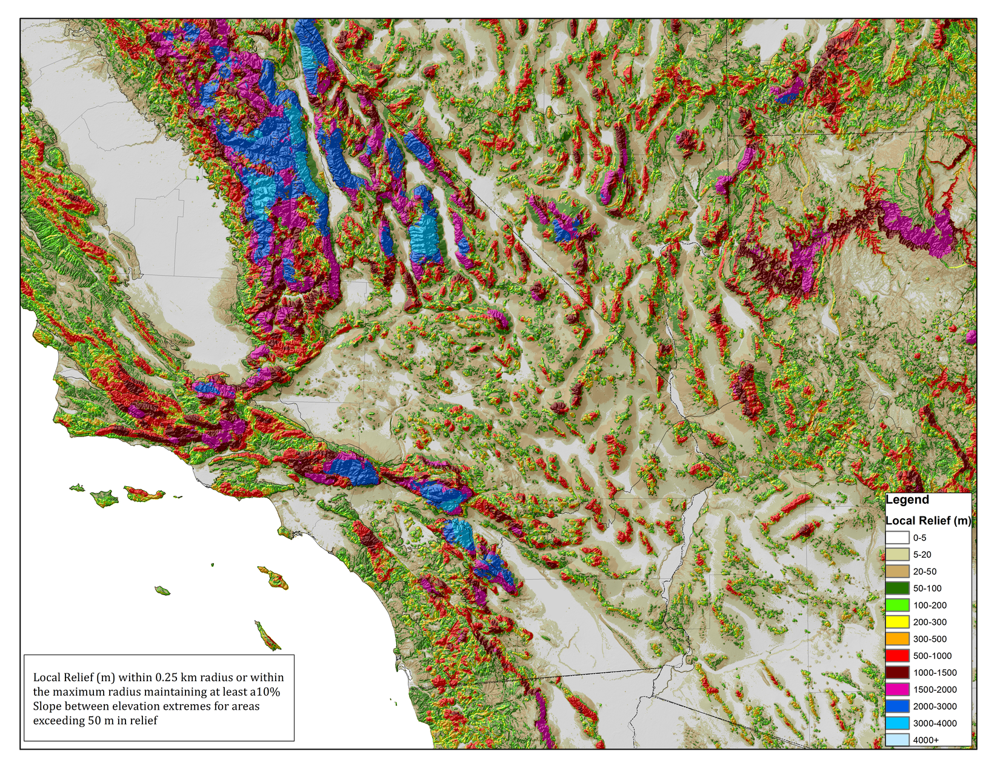

<html><head><style>li {list-style-type: none;}</style></head></html>
```{r setup, include=FALSE}

knitr::opts_chunk$set(echo = TRUE)
```
Growing up in the relative flatness of Michigan, a trip to the western Upper Peninsula's Porcupine Mountains was considered my first in person view of Mountains. Yet these hills, while much bigger than those of my hometown, still seemed a bit short. Photographs of the Appalachians seemed to me much more impressive, while those of the Rockies were at times difficult to relate to due to the lack of vegetation. It was the size of the trees of forested peaks that provided a relative scale. Landscapes in northern lower Michigan seemed to provide long vistas, yet didn't photograph well. The total relief in some areas work reasonably impressive compared to neighboring states, but vertical climbs took place over such long distances it was difficult to see the hills as one got closer.

In order to measure a mountain, I needed to consider horizontal distance between a base and a summit. A fixed horizontal distance just wouldn't do, slope had to be considered. Rolling plains might be just as "big" as a large hill, yet not at all noticeable in a landscape photo. A large mountain would be truncated and equated to a smaller mountain if one stopped measuring at a fixed distance. Another method called "prominence" was also not adequate, as it doesn't consider distance or slope at all. Other methods exclude plains by simply considering slope as an additional requirement, but still leave large mountain relief under-measured. 

I considered one particular peak that rose 1000 ft (300 m) above lake superior within a distance of 1 mile (1.6 km), and asked myself, how far inland must a peak get from the lake to still use the lake as the baseline. I drew a profile and arbitrarily decided that I wouldn't go any more than double that distance for the same height difference. Thus was born the 10% slope rule: a mountain's tallness is measured from the summit to the lowest elevation within a slope of 10% or more. [I also got distracted by the question of how to measure a waterfall (or a cliff), and decided that it had to fall at least as far as it flowed on the map or a 100% slope rule.] Essentially, this is a cone radiating from the mountain top, but it could also be from the mountain shoulder if the peak is broad and flat.

In my high school years of the late 1980s, I collected topographic maps; and the idea of a GIS was not yet in my consciousness. The larger a hill, the greater the distance from the summit could be considered. One early goal was to find out how each US state ranked in terms of mountain tallness. It was not a simple task to search over topographic maps and measure two variables by hand. Measurement strategy was usually to look at the highest peaks first, but there are some peaks of similar heights adjacent to lower elevations. There are also multiple directions one could measure from a peak. In other cases, it is a canyon rim that has to be measured along a continuum. I compiled a list of tall sites by the mid 1990s with additional access to maps in libraries and early versions of Delorme map software, prior to my introduction to GIS.

```{r, echo=FALSE, warning=FALSE}
library(knitr)
statemountains <- read.csv('terrain/statemountains.csv')
kable(statemountains, caption = 'Tallest peaks by state (with a few international superlatives) - maximum elevation range in meters within a 10% Slope ')
```

Creating a map with modern GIS wasn't a simple task either. The technique settled upon was to assess the focal maximums and minimums for a series of focal distances. For this task, a 250 m resolution grid was utilized for the Lower 48 United States. A finer 30 m grid was assessed for local areas of interest in lower Michigan, New England, and east Tennessee. When necessary due to memory limitation for the larger radii, the grid was resampled to a coarser resolution after a preliminary smaller radius maximum and minimum focal analysis. The smallest radius was the limited by the grid resolution, so relief less than 25 m is not represent is not restricted to 10% slopes or or is otherwise underestimated where summits are smaller than the grid size. After a set of relief grids at each radius increment was generated, they were integrated into a single continuous grid. The the maximum value among grids representing a relief with at least a 10% slope was determined. Intermediate values were interpolated where adjacent where adjacent radii are above and below the 10% slope threshold.







