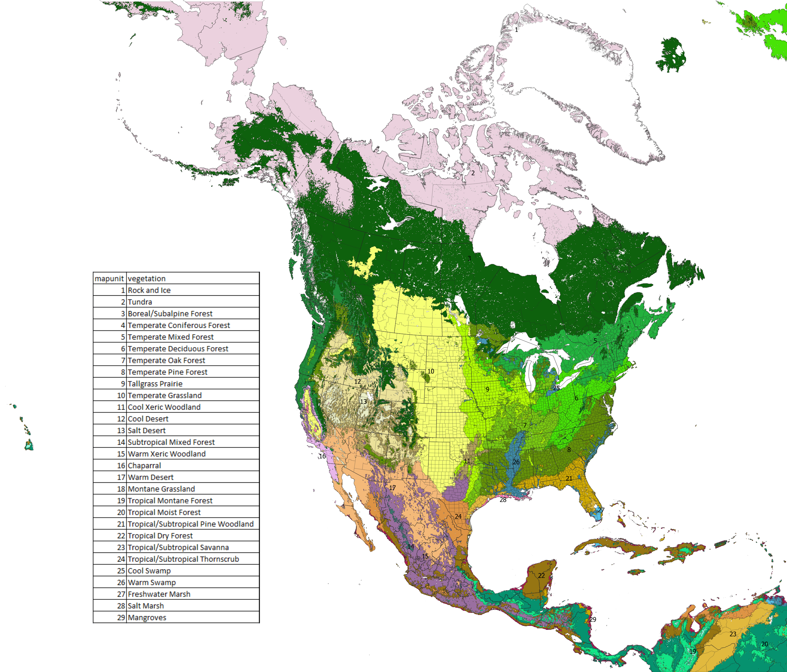
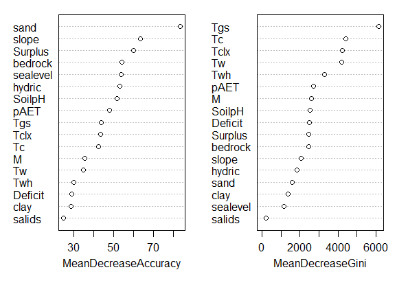

<html><head><style>li {list-style-type: none;}</style></head></html>
```{r setup, include=FALSE}
knitr::opts_chunk$set(echo = TRUE)
```





Variables in Figure 13:
Tgs = growing season temperature;
Tc = coldest monthly temperature;
Tclx = extreme annual low temperature;
pAET = peak monthly evapotranspiration;
M = precipitation/potential evapotranspration ratio;
SoilpH = soil pH;
Surpus = cumulative annual precipitation surplus above monthly need;
Deficit = cumulative annual precipitation deficit above monthly need;
slope = mean slope;
hyrdic = percent wetland soils;
sand = percent sand (0-60 cm);
clay = percent clay (0-15 cm);
sealevel = combined index of elevation and proximity to the coast for coastal vegetation;
salids = percent saline desert soils; 
Tw = warmest monthly temperature;
Tw = warmest monthly high temperature;
bedrock = percent of soils with bedrock within 2 m.

Vegetation was classified based on GIS data associated with World Wildlife Fund ecoregions (Olsen et al, 2001) and Kuchler potential natural vegetation (Kuchler, 1964). Some biomes were subdivided by overlaying a map by Brown et al (1995) to show thornscrub as separate from warm deserts and tropical dry forests. Portions of "tropical moist forest" mapped as "semi-evergreen forest" by Brown et al (1995) were reclassified as "tropical dry forest", and were indeed in a subhumid climate zone. Over all this resulted in a shift in the areas mapped tropical dry forest from dry to moist. Chaparral vegetation was recognized beyond California. Only areas of tropical coniferous forest that occurred in lowlands were put in a group call tropical pine forest. Areas of Mexico pine-oak woodlands, Texas oak woodlands, and California oak woodlands were grouped as "warm xeric woodlands". The highest elevations in Mexico were recognized by Brown et al (1995) as an extension "montane conifer forest" and are here considered "temperate coniferous forest"" by their presence of fir. Some subdivision of desert vegetation based on grass cover was considered, but not undertaken. Semi-desert grasslands were maintained in "warm desert". Shrub-steppe was maintained as part of "cool desert". Pinyon-juniper woodlands and crosstimbers were treated as "cool xeric woodlands".

***
[Go Back](./index.html)
